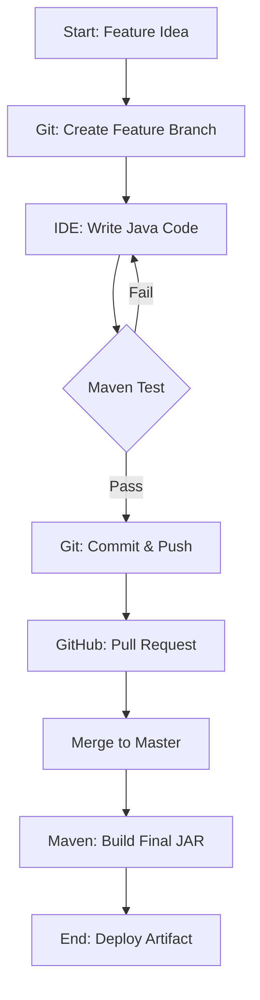

# SYNOPSIS - PAGE 1 (Front Page & Title)

## [FRONT PAGE]

**SYNOPSIS**

**Project Title:** SHADOW SPIES: TACTICAL STEALTH GAME WITH DEVOPS INTEGRATION

**Submitted By:**
**Name of Student:** [YOUR NAME HERE]
**Class / Roll No.:** [YOUR CLASS/ROLL NO HERE]

**Course Code:** INT331
**Course Title:** FUNDAMENTALS OF DEVOPS

**Department:** Computer Science & Engineering

**Submitted To:**
**Instructor Name:** [INSTRUCTOR NAME HERE]

**Session:** 2025-26

---

## 1. Title of the Project
**Shadow Spies: A Tactical Stealth Strategy Game Implemented with DevOps Methodologies**

## 2. Introduction
**Shadow Spies** is a two-player, local competitive strategy game inspired by the classic *Spy vs Spy*. It challenges players to outwit each other in a grid-based arena, utilizing stealth, trap placement, and resource management.

However, the primary academic significance of this project lies in its development lifecycle. Unlike traditional student projects that focus solely on the output, this project emphasizes the **process**. We integrate core DevOps practices—specifically **Version Control (Git)** and **Build Automation (Apache Maven)**—from Day 1. This ensures that the software is not just "written," but scientifically managed.

---

# SYNOPSIS - PAGE 2 (Objectives & Architecture)

## 3. Objectives of the Project
1.  **Develop a Robust Game Engine**: To create a Java-based simulation that handles real-time input from two users simultaneously.
2.  **Implement Version Control Best Practices (CO3)**: To utilize **Git** for tracking every stage of development, demonstrating branching, merging, and remote repository management.
3.  **Automate Build Processes (CO6)**: To transition from manual command-line compilation to a standardized **Apache Maven** build lifecycle.

## 4. Methodology: The DevOps Flowchart
This project follows a strict linear workflow to ensure code quality and reproducibility.

*Figure 1: The Project Development Lifecycle (DevOps Pipeline)*

The Flowchart above illustrates the "Continuous Integration" mindset adopted for this project. No code flows to the `master` branch without passing local compilation checks via Maven.

---

# SYNOPSIS - PAGE 3 (Problem Statement & Scope)

## 5. Problem Statement / Need of the Project
**The Consistency Challenge**:
In academic environments, the "It works on my machine" syndrome is rampant. Code that runs perfectly on one developer's laptop often fails on another due to configuration errors.

**The Collaboration Gap**:
Without a centralized Version Control System, teams often resort to manual file sharing. This leads to data loss and "Integration Hell" where merging work becomes impossible.

**The Solution**:
This project solves these issues by enforcing a **Configuration-as-Code** approach using a standard `pom.xml` for builds and a clean Git history for collaboration.

## 6. Scope of the Project
**Functional Game Scope**:
*   **Mechanics**: Grid movement, Trap placement, Item collection, Win/Loss conditions.
*   **Platform**: Desktop Application (Windows/Linux/MacOS) running on Java 17.

**DevOps Scope**:
*   **SCM**: Local Git repo and remote GitHub synchronization.
*   **Build**: Use of Maven for dependency resolution and packaging (`.jar`).
*   **Exclusion**: No Docker/Cloud deployment in this phase.

---

# SYNOPSIS - PAGE 4 (Outcomes & Tools)

## 7. Development Tools Used
The project follows an **Iterative Development Model**.

**A. Core Technologies**:
*   **Java 17**: The primary language for game logic.
*   **Java Swing**: For rendering the graphical interface.

**B. DevOps Toolchain (Unit VI)**:
*   **Git**: Used for source code management. We utilize a `feature-branch` workflow where new mechanics are built in isolation.
*   **Apache Maven**: Acts as the project management tool. It standardizes the directory structure (`src/main/java`) and creates the build artifacts automatically.

## 8. Expected Outcomes
Upon successful completion, this project will deliver:

**Tangible Deliverables**:
1.  **Playable Software**: A `shadow-spies.jar` file that can be executed on any standard computer.
2.  **DevOps History**: A Git repository containing a verified log of commits, demonstrating the evolution of the project.

**Intangible Learning Outcomes**:
1.  **Proficiency in Git CLI**: Mastery of commands like `commit`, `push`, `pull`, and `status`.
2.  **Maven Lifecycle**: Understanding the difference between `compile`, `test`, and `package`.

---

# SYNOPSIS - PAGE 5 (Timeline & References)

## 9. Project Timeline
| Phase | Duration | Key Activity |
| :--- | :--- | :--- |
| **Week 1** | 5 Days | **Setup**: Install Git/Maven, Initialize Repo. |
| **Week 2** | 7 Days | **Core Logic**: Code Player/Grid classes. First Commit. |
| **Week 3** | 7 Days | **UI Design**: Implement Main Window and Graphics. |
| **Week 4** | 5 Days | **Maven Integration**: Create POM.xml, standardize folder structure. |
| **Week 5** | 3 Days | **Final Polish**: Write documentation and submit Synopsis. |

## 10. References

**Textbooks & Academic Resources**:
1.  **Bass, L., Weber, I., & Zhu, L.** (2015). *DevOps: A Software Architect's Perspective*. Addison-Wesley Professional.
2.  **Loeliger, J., & McCullough, M.** (2012). *Version Control with Git*. O'Reilly Media.

**Documentation**:
3.  **Official Git Documentation**: [https://git-scm.com/doc](https://git-scm.com/doc)
4.  **Apache Maven Project**: [https://maven.apache.org/guides/](https://maven.apache.org/guides/)
5.  **Oracle Java Documentation**: [https://docs.oracle.com/en/java/javase/17/](https://docs.oracle.com/en/java/javase/17/)
